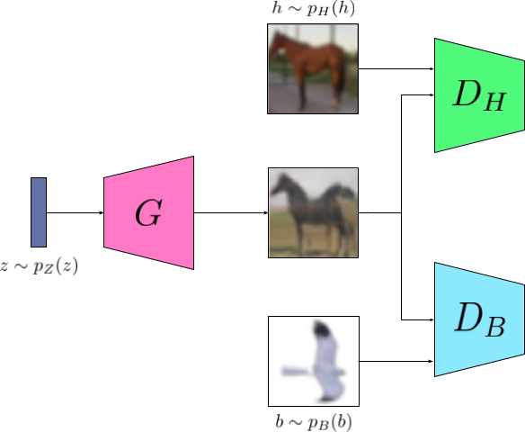
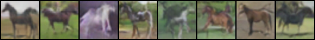

# Pegasus Image Generation

## Problem Description

A pegasus is a mythical creature that is a horse with wings. Given images from the [CIFAR-10 dataset](https://www.cs.toronto.edu/~kriz/cifar.html), produce a model that can generate images of Pegasuses.

It can be interpreted that a pegasus is a creature that is a mixture of horse and bird. Leading to a pegasus having a high joint probability of being a horse and a bird $p(H \cap B)$.

## JointGAN

### GAN
The GAN allows a generator network to be trained to map noise to realistic samples from some data distribution. GANs can learn to do this sampling without having to estimate the density function of the distribution. This is done by training two networks playing an adversarial mini-max game:

$$\min_G \max_D V(D,G) =\mathbb{E}_{x\sim p_{data}(x)}[\log D(x)]+\mathbb{E}_{z\sim p_z(z)}[\log(1-D(G(z)))]$$

Where the discriminator network $D$ learns to estimate $p_{data}$, while the generator network learns produce samples from the data distribution given some random noise vector $z\sim p_{z}$.

### Generating samples from a joint distribution

JointGAN allows for a generator network to be adversarially trained to sample from some joint distribution $p\left(\bigcap_{c_i\in C}c_i\right)$ using samples from the constituent marginal distributions $p\left(c_i\right)$.

This is achieved by using $|C|$ discriminator networks, where the discriminator $D_i$ predicts $p\left(c_i\right)$.

We can define the class loss as:

$$L_c = \mathbb{E}_{x\sim p_{c}(x)}[\log D(x)]+\mathbb{E}_{z\sim p_z(z)}[\log(1-D_c(G(z)))]$$

Then JointGAN can be trained on the objective:

$$\min_G \max_{D_{c_1},...,D_{c_{|C|}}} \sum_{c_i\in C}L_{c_i}$$

This loss allows for the generator to sample from the joint distribution assuming that the marginal probabilities are independent.

## Using JointGAN to generate Pegasus images

The dataset contains images of both birds and horses. We can use JointGAN to train the generator to sample from $p(H \cap B)$.

The horse discriminator will be trained on generator outputs and horse images from the dataset. The bird discriminator wil be trained on the generator outputs and bird images from the dataset.

### Training stability

Care must be taken to ensure that the training does not collapse. It is common for the discriminators to become too powerful too quickly as the generator has to generate data that can fool multiple discriminators at once.

To ensure the discriminators do not learn too quickly and collapse the training process spectral normalization is applied. This ensures that the discriminators loss is $k$-Lipschitz - the discriminators gradients are bound by a constant $k$.

## Results

